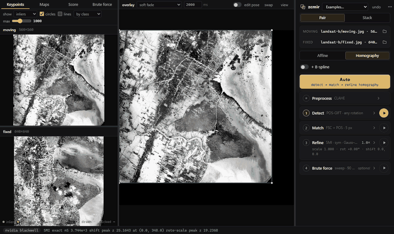

# zcmir

Multimodal image registration on the GPU, in the browser. zcmir aligns two images of the same region taken with different instruments or contrasts, such as EBSD maps to polarized light micrographs, near-infrared to RGB aerial photos, or fluorescence to bright field.



## Run the app

Open it at <https://zacharyvarley.github.io/zcmir/>, or run it locally:

```bash
pip install zcmir
python -m zcmir
```

This serves the app on <http://127.0.0.1:4180/> and opens it in your browser. Everything runs on your GPU inside the page, so your images never leave your machine. You need Chrome or Edge 137+ (WebGPU and JavaScript Promise Integration). `--port` picks another port (a free one is used if 4180 is taken), and `--no-browser` only prints the URL. pip also installs a `zcmir` command that does the same; like any package's command, it exists only inside the environment you installed into.

To install from a clone instead, run `pip install .` in it. The first build downloads Zig and wgpu-native into `.deps/` and compiles for your machine, which takes a minute or two.

Open a moving and a fixed image (or drop both on the window), or pick one of the **Examples**, then press **Auto**. Each step also has its own card, settings and play button:

| Step | What it does |
|---|---|
| **Detect** | POS-GIFT keypoints [[7]](#references), modified (see [below](#pos-gift-in-zcmir)), or GLS-MIFT as a faster alternative |
| **Match** | nearest descriptors, a robust fit of your choice (FSC / PROSAC / MAGSAC++) at your inlier distance, optional POS-guided re-matching; every fit is held to pose limits (no folding, mirroring, or extreme scale, stretch or perspective) |
| **Refine** | Gauss–Newton ascent of the similarity over an affine or homography, optionally with a cubic B-spline under a thin-plate bending penalty, entirely on the GPU |
| **Brute force** | optional: a sweep over rotation (the full circle, ± a half-range, or a from–to range) × scale × translation, optionally × shear × stretch, or a cloud of seeds around the pose |

The **Maps** tab shows the similarity at every translation, and at every rotation × scale, around the current pose. **Stack** mode registers serial sections or a time series slice by slice. It carries each pose to the next slice, retries keypoints when the score drops, and flags slices that break from their neighbours' trend. A registered pair exports its transform and a displacement field (NRRD plus an ITK `.tfm`); a stack exports as a TIFF stack or PNG files.

## How the similarity is computed

Mutual information (MI) is the standard similarity for images of different modalities. Heldmann et al. [[1]](#references) and August and Kanade [[2]](#references) originated estimating it densely with FFTs and the convolution theorem. Öfverstedt, Lindblad and Sladoje [[3]](#references) made it fast for global alignment: binned MI at every translation, from FFT cross-correlations of the intensity-bin indicator images. Its cost grows with the number of bin pairs.

I proposed replacing binned MI with cheaper estimates built from a few moments, so the whole map takes a small, fixed number of FFTs. I first tried the Edgeworth approximation of Rubeaux et al. [[4]](#references), which is very inexpensive in moments and FFTs. In my thesis [[5]](#references) I extended it to fourth order from non-central moments (still available as the E4 score), but I found these approximations numerically unstable.

After exploring the literature I settled on **square-loss mutual information** (SMI) [[6]](#references). Each image is described by four channels: its rank r (histogram-equalized intensity), r², r³, and the Sobel gradient magnitude of r. With this linear basis, SMI is the squared norm of the whitened cross-covariance of the two images' channels over their overlap. Every term is a sum over the overlap, so the score at every translation takes 45 FFT cross-correlations, however many intensity levels the images have. The same moments give Refine its score, gradient and Gauss–Newton curvature.

The **λmax** score (in the Refine card's Score menu) also works well, especially for images without sharp boundaries. It is the Gaussian-copula MI of the top canonical correlation between [z, z², z³] of each image's normal scores.

## POS-GIFT in zcmir

POS-GIFT [[7]](#references) gives good matches across a huge variety of multimodal registration tasks, but its authors released it only as closed MATLAB code. I reverse engineered it, reimplemented it on the GPU, and modified it. zcmir's defaults differ from the authors' code as follows:

| | Authors' released code | zcmir default |
|---|---|---|
| Keypoint map | normalized phase-congruency sum | minimum moment of phase congruency |
| Rotation | an orientation per keypoint (Sobel histogram) | upright descriptors; one global rotation chosen among 24 hypotheses 15° apart (descriptors turned by channel permutation, plus a 15°-turned copy of the image), ranked by match consensus |
| Descriptor sharpness | per-pixel range-normalized channels | the same, raised to a power (1.5, `pg_desc_pow`) and normalized per sampled point |
| Patch radius (P1) | 16 | 10 |
| Matching | one pooled match and FSC over every scale pair | consensus per scale pair, then one fit |
| Final model | homography | the model you choose (homography by default): the POS fit or the pooled fit, whichever scores higher |

I chose these changes on EBSD ↔ BSE sections and rotated cross-modal pairs, where they reduced gross failures. Per-keypoint orientation is reliable within one modality but often wrong across modalities, hence the global rotation search. `zcmir.register(moving, fixed, pg_released=True)` reproduces the authors' behaviour, and the app's Detect card has switches for the rotation search and the keypoint map.

## Python

The same engine is available as plain Python functions:

```python
import zcmir

r = zcmir.register(moving, fixed)                 # keypoints → robust fit → refine (homography)
r.H, r.score                                      # 3×3 moving → fixed (1-based pixels)
warped = r.warp(moving)
r = zcmir.register(moving, fixed, spline=True)    # + a cubic B-spline
s = zcmir.register_stack(moving_slices, fixed_slices)
s.save_tiff("registered.tif", moving_slices)
```

Images are numpy arrays, or file paths if Pillow is installed (`pip install zcmir[images]`). `zcmir.settings()` lists every option, and every function accepts them as keywords.

### Tutorials

Three notebooks in [examples/](examples/) work through one example pair, two Landsat 8 views of a river in flood and dry seasons, with a known pose:

| Notebook | What it shows |
|---|---|
| [01_register](examples/01_register.py) | Registering the pair, checking the result against the truth, refining from a rough guess, and a B-spline recovering a known bend |
| [02_pos_gift](examples/02_pos_gift.py) | POS-GIFT step by step: oriented phase congruency, keypoints on the pyramid, one descriptor drawn on its rings, the rotation search and the matches |
| [03_smi](examples/03_smi.py) | SMI rebuilt in NumPy and checked against the engine: the 45 overlap sums, the score, the shift and roto-scale maps as FFT cross-correlations, and the Jacobian behind Refine's gradient |

CI runs them on a GitHub M1 runner against the freshly built wheel. The executed notebooks, with every figure, are at <https://zacharyvarley.github.io/zcmir/tutorials/> and attached to each release. To run them yourself, `pip install zcmir matplotlib scipy jupytext`, then open the `.py` files as notebooks or run `python scripts/run_tutorials.py out/`.

## Building and contributing

The registration code is Zig and WGSL. It compiles to a native library (Vulkan, Metal or Direct3D 12 through wgpu-native) and to WebAssembly for the browser, so the app and the Python package run the same code. See [CONTRIBUTING.md](CONTRIBUTING.md).

## License

MIT ([LICENSE](LICENSE)). The wheels bundle [wgpu-native](https://github.com/gfx-rs/wgpu-native) (MIT / Apache-2.0). The example images keep their own terms, public domain (NIST, NASA / USGS) or CC BY 4.0 ([sources](web/app/presets/ATTRIBUTION.md)).

## References

1. S. Heldmann, O. Mahnke, D. Potts, J. Modersitzki, B. Fischer. Fast computation of mutual information in a variational image registration approach. *Bildverarbeitung für die Medizin (BVM) 2004*, pp. 448–452. [doi:10.1007/978-3-642-18536-6_92](https://doi.org/10.1007/978-3-642-18536-6_92)
2. J. August, T. Kanade. The role of non-overlap in image registration. *Information Processing in Medical Imaging (IPMI) 2005*, LNCS 3565, pp. 713–724. [doi:10.1007/11505730_59](https://doi.org/10.1007/11505730_59)
3. J. Öfverstedt, J. Lindblad, N. Sladoje. Fast computation of mutual information in the frequency domain with applications to global multimodal image alignment. *Pattern Recognition Letters* 159 (2022) 196–203. [doi:10.1016/j.patrec.2022.05.022](https://doi.org/10.1016/j.patrec.2022.05.022)
4. M. Rubeaux, J.-C. Nunes, L. Albera, M. Garreau. Medical image registration using Edgeworth-based approximation of mutual information. *IRBM* 35(3) (2014) 139–148. [doi:10.1016/j.irbm.2013.12.004](https://doi.org/10.1016/j.irbm.2013.12.004)
5. Z. T. Varley. *Algorithms for Crystallography in the Scanning Electron Microscope.* PhD thesis, Carnegie Mellon University, 2024.
6. M. Sugiyama. Machine learning with squared-loss mutual information. *Entropy* 15(1) (2013) 80–112. [doi:10.3390/e15010080](https://doi.org/10.3390/e15010080)
7. Z. Hou, Y. Liu, L. Zhang. POS-GIFT: A geometric and intensity-invariant feature transformation for multimodal images. *Information Fusion* 102 (2024) 102027. [doi:10.1016/j.inffus.2023.102027](https://doi.org/10.1016/j.inffus.2023.102027)
